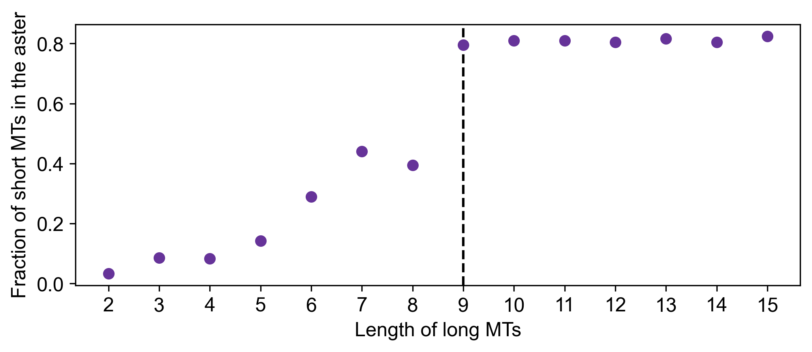

# Percolation simulation
In experimental settings, we observe a small number of long microtubules (MTs) generated from bundling. We are interested to see how these long MTs affect local and global contractile behavior. In cytosim, it is difficult to simulating bundling, therefore we spike in a number of long MTs as a proxy for the MT bundles and observe the effect of these long MTs on our contractile network.

## Run series 0
**run000** -- I used the baseline config file (run 46 provided by Matt) and was able to reproduce aster formation.\
**run001** -- I added 10% of long microtubules that are 10 times that length of the original microtubules (15 vs. 1.5). Global contraction was observed.\
**run002** -- I reduced the total number of microtubules from 18000 short + 1800 long to 2000 short + 200 long. Accordingly, I reduced the total number of motors from 45000 to 5000. I was still able to see global contraction.\
**run003** -- I used the same number of MTs and motors as in **run002**, but here I shortened the long microtubules.

## Run series 1 and 2
From the previous trial runs, we know that the minimum length of long MTs required for contraction is between 5 to 15. Now we perform a parameter search to look for the minimum length of long MTs required for global contraction.

I simulated the system using long MTs of length 2 to 15, with an interval of 1. The minimum length of long MTs is around 9 (**run series 1**) or 8 (**run series 2**). Interestingly, in some simulations we see that asters first form locally and then merge to become a global contractile network (e.g. **run0006 in run series 2**).

Additionally, we also reported the center position of each microtubule. Using the code in `active-matters-programmed-phase-transition/aster-analysis.ipynb`, I quantified quantified the percentage of short microtubules in the central aster region. As shown in the figure below, this is around 75% to 80% and is much higher the ratio between the area of the aster and the total area of the system, therefore it is unlikely that the short MTs aggregated in the aster region by chance. This increases our confidence that a global contractile network has indeed formed.

## Run series 3
Now that we have determined the minimum length of long MTs requried to produce global contraction, we would also like to know the minimum number/percentage of long MTs needed. As a first pass, I reduced the number of long MTs from 10% to 1%. Here we see that we no longer see a global contractile network even when the MTs are at the maximum length of 15. However, we do see some asters merging as the simulation progresses, and therefore it may be possible that the system will eventually reach global contraction if the simulation was allowed to run for longer.

## Run series 4
At this point we noticed that in the initial condition, the MTs are fairly dense within our field of view. In a typical experiment, there is around 1 MT per $\mu m^3$ of space. Translating this to a 2D space, we would still expect to see 1 MT per $\mu m^2$ of space. To approximate the experimental conditions as closely as possible, we reduced the total number of MTs in the system to 1000 MTs in a circle of radius 17.84 (which means the area of the circle is around 1000). Additionally, we reduced the length of the short microtubules from 1.5 to 1.

Under these conditions, we can see by eye that the MTs are a lot more spare in the initial frame than before. Additionally, when 10% of the MTs are long MTs, the minimum length of the long MTs required for global contraction is about the same as before, at a length of 9. However, it is worth noting that in terms of ratio, this is 9 times the length of the short MTs whereas before, it was 6 times the length of the short MTs.

## Run series 5
As in run series 3, we reduce the number of long MTs from 10% to 1%. Again, we do not see global contraction even when the MTs are at the maximum length of 15.

## Run series 6
Given the results in **run series 4** and **run series 5**, now we perform a parameter search to look for the minimum percentage of long MTs required for global contraction. Here we see that we only need around 3% of the MTs to be long.

## Run series 7
In this series of simulations we set the total number of MTs to be 30, which, as determined in **run series 6**, is the minimum number of MTs requried for global contraction when the long MTs are of length 15. Now we reduce the length of the MTs in order to search for the point where the length and number of MTs can both be minimized. We observe global contraction when the MTs are of length 12 but not shorter. Additionally, even under these conditions, there are local asters forming around the big aster, therefore we do not have a strictly global contractile network.

## Run series 8
We are interested to see whether initial incubation with dead motors would facilitate global contraction. I first incubated the MTs in 1000 dead motors and then added 5000 active motors. Interestingly, this appears to inhibit global contraction as it both increases the minimum required length of the long MTs and increases the amount of time needed for the global contractile network to form even when the long MTs are above the required length.

## Run series 9
To more closely approximate our experimental conditions, here we define the length of the MTs according to a negative binomial distribution with a long tail. We continue to observe global contraction when $p=0.4$.

## Run series 10
We would like to determine the maximum allowed value of $p$ in a negatie binomial distribution. It turns out that we do not get global contraction for $p$ above 0.4. Even when $p = 0.4$, we do not consistently get global contraction.

